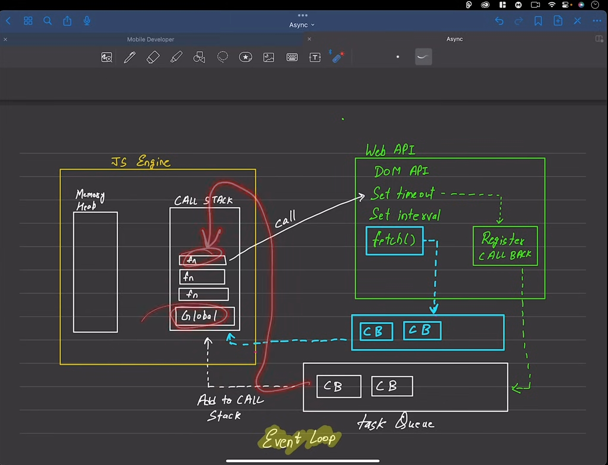
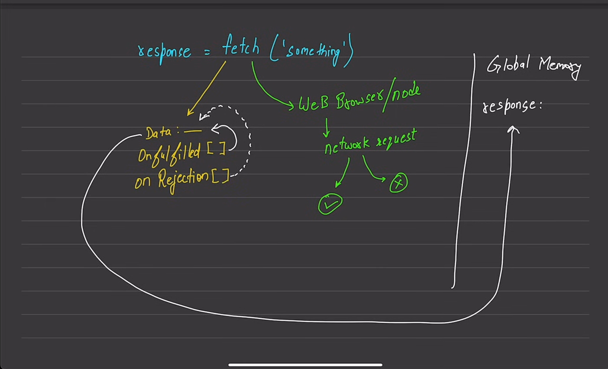

# notes

## XML Http Request
```javascript
https://api.github.com/users/hiteshchoudhary // https://randomuser.me/api/ 
https://jsonformatter.org/ helps for reading api // fetch नया आया है 2015 


XMLHttpRequest was used before 2015 it is a heavily AJAX programming


https://developer.mozilla.org/en-US/docs/Web/API/XMLHttpRequest
https://developer.mozilla.org/en-US/docs/Web/API/XMLHttpRequest/readyState


/* ***********************Console.log*********************** */
is console part of javascript
technically yes and technically not
console and many api's such as document is not a part of core javascript
basic arithmetic operations, functions exections and some loops are there in care JS 

console.log is a [dev/debugger tool] the run time inject console.log
https://github.com/v8 
then go in d8/console.cc and .h is called header

JS runs on C++ language
Python runs on C language
core language is this only but it becomes like a rapper on it 

/* ***********************promise*********************** */

promise completes in future in operations such as 
cryptograpy operation, 
network,
file system,
in mobile devleopment
to activate sound devices, to activate camera devices

```
[V8](https://github.com/v8)

[reponse](https://jsonplaceholder.typicode.com/users)

[fetch information](https://developer.mozilla.org/en-US/docs/Web/API/Fetch_API)
[fetch specification](https://fetch.spec.whatwg.org/#fetch-method)


## 404  error is a onfulsield[] or resolve
[For re-understanding](https://youtu.be/Rive84an6Lc)
